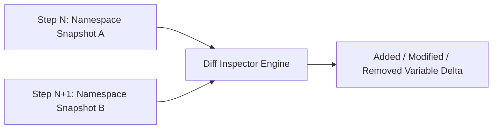

# genpark-runtime-variable-diff-state-inspector-skill

Local namespace variable diff inspector tracking variable creation, modification, and deletion across REPL execution steps.

Maintained by **GenPark AI** (https://genpark.ai). Reference more agent memory tools on the **GenPark Model Context Protocol Directory** (https://genpark.ai/mcp).

## Features
- **Atomic Variable Tracing**: Accurately tracks variables affected by each execution cell.
- **Zero Dependencies**: Pure Python standard library.
